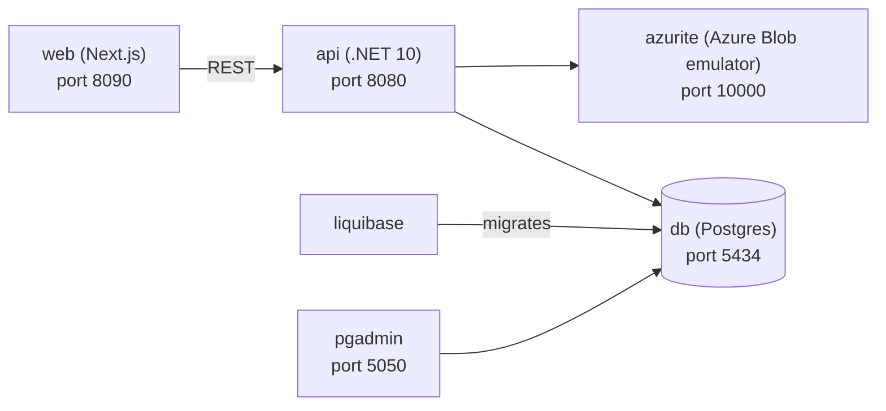

# nextjs

A small full-stack CRM-style sample app: a .NET API backed by Postgres (via Liquibase migrations) and blob storage for documents, with a Next.js web frontend. Local development uses Azurite, and the API now supports Azure Blob Storage by default with AWS S3 as an optional alternative.

## Architecture



- `web`: Next.js 16, React 19 frontend UI. See [web/README.md](web/README.md).
- `api`: .NET 10, Dapper REST API for contacts, countries, and documents. See [api/README.md](api/README.md).
- `db`: Postgres 18 primary database. See [database/README.md](database/README.md).
- `liquibase`: Liquibase 5 migrations and seed data. See [database/README.md](database/README.md).
- `azurite`: Local Azure Blob Storage emulator for documents.
- `localstack`: Local AWS-compatible S3 emulator for documents.
- `pgadmin`: Optional Postgres admin UI.

## Document storage

- The API selects the document storage provider from `ObjectStorage:Provider`.
- `Azure` is the default provider when no explicit value is set.
- Local Docker uses Azurite by default on port `10000`.
- Local Docker can also use LocalStack S3 on port `4566` by setting `OBJECT_STORAGE_PROVIDER=Aws` before startup.
- Local `dotnet run` can target either provider through the matching `ObjectStorage:*` settings.

## Getting started

Requirements: Docker + Docker Compose.

```bash
make start   # build and start everything
make api     # start db + api only
make db      # start db + liquibase only
make azurite # start local blob storage only
OBJECT_STORAGE_PROVIDER=Aws make start # switch local Docker to LocalStack S3
make stop    # stop all containers
```

Ports and credentials are configured in [.env](.env).

## Local (non-Docker) development

- **api**: `cd api/App.Api && dotnet run` (uses [appsettings.Development.json](api/App.Api/appsettings.Development.json), expects `db` on `localhost:5434` and Azurite on `localhost:10000` by default; switch `ObjectStorage:Provider` and `ObjectStorage:Aws:*` if you want local S3 instead).
- **web**: `cd web && npm install && npm run dev` (hot-reloading dev server on port 3000).

For local document uploads, the API creates the `documents` blob container automatically when it starts.

Note: services started with `docker compose up -d` do **not** hot-reload — rebuild the image after code changes with `docker compose up -d --build <service>`.

## Azure foundation and deploy

The GitHub Actions deployment flow uses Azure OIDC via `azure/login@v2`. The shared foundation workflow is [setup-foundation.yml](.github/workflows/setup-foundation.yml).

### 1. Log in to Azure CLI

Authenticate first:

```bash
az login
```

### 2. Get the Azure subscription ID

Run this next and keep the result for the following steps:

```bash
az account show --query id --output tsv
```

### 3. Create the Azure app registration for GitHub Actions

Create an Entra ID app registration and service principal that GitHub Actions can use. Replace the placeholders below with names that fit your own naming convention. The command also assigns `Contributor` on the current subscription and prints the values you need for GitHub:

```bash
az ad sp create-for-rbac \
    --name "<app-registration-name>" \
    --role Contributor \
    --scopes "/subscriptions/$(az account show --query id -o tsv)" \
    --query '{AZURE_CLIENT_ID:appId,AZURE_TENANT_ID:tenant,AZURE_SUBSCRIPTION_ID:subscription}'
```

Record these values from the output:

- `AZURE_CLIENT_ID`
- `AZURE_TENANT_ID`
- `AZURE_SUBSCRIPTION_ID`

If you prefer to create the app registration separately, make sure the resulting service principal has enough access to deploy the subscription-level and resource-group-level infrastructure used by `infra/azure/subscription.bicep`. `Contributor` on the target subscription is the simplest option for initial setup.

### 4. Add the federated credential for this repo

In the Azure app registration, add a federated credential that matches this repository and the GitHub environment used by the workflows:

```bash
az ad app federated-credential create \
        --id "<AZURE_CLIENT_ID>" \
        --parameters '{
            "name": "<app-registration-name>",
            "issuer": "https://token.actions.githubusercontent.com",
            "subject": "repo:im-mk/nextjs:environment:production",
            "description": "GitHub Actions deployments",
            "audiences": [
                "api://AzureADTokenExchange"
            ]
        }'
```

- issuer: `https://token.actions.githubusercontent.com`
- subject: `repo:im-mk/nextjs:environment:production`
- audience: `api://AzureADTokenExchange`

This must match the workflow environment in [setup-foundation.yml](.github/workflows/setup-foundation.yml). Branch deploy and teardown workflows also use the same `production` GitHub environment, so you do not need a separate `preview` environment.

The issuer, subject, and audience must match the GitHub OIDC token exactly. In particular, do not add a trailing `/` to the issuer. If you already created the credential with `https://token.actions.githubusercontent.com/`, delete and recreate it with the exact issuer above or Azure login will fail with `AADSTS700211`.

To inspect existing federated credentials on the app:

```bash
az ad app federated-credential list \
    --id "<AZURE_CLIENT_ID>" \
    --query '[].{name:name,issuer:issuer,subject:subject,audiences:audiences}'
```

If needed, recreate the credential:

```bash
az ad app federated-credential delete \
    --id "<AZURE_CLIENT_ID>" \
    --federated-credential-id "<credential-name>"

az ad app federated-credential create \
    --id "<AZURE_CLIENT_ID>" \
    --parameters '{
        "name": "<credential-name>",
        "issuer": "https://token.actions.githubusercontent.com",
        "subject": "repo:im-mk/nextjs:environment:production",
        "description": "GitHub Actions deployments",
        "audiences": [
            "api://AzureADTokenExchange"
        ]
    }'
```

### 5. Configure GitHub environment secrets and variables

In GitHub, open `Settings -> Environments -> production` and set these values.

Local development uses Azurite via Docker Compose. The Azure foundation deployment path now provisions Azure Blob Storage for documents.

The same `production` environment is used for `Setup Foundation`, branch deploys, and branch teardown. A separate `preview` GitHub environment is not required.

Secrets:

- `AZURE_CLIENT_ID`
- `AZURE_TENANT_ID`
- `AZURE_SUBSCRIPTION_ID`

Variables:

- `AZURE_RESOURCE_GROUP` (defaults to `nextjs`)
- `AZURE_LOCATION` (optional, defaults to `uksouth`)

The workflow now validates these before attempting Azure login, so missing configuration fails with a direct error instead of the generic `SERVICE_PRINCIPAL` message.

The database admin password is generated automatically on first foundation deployment, stored in Key Vault as `database-admin-password`, and reused on later runs.

### 6. Run the foundation workflow

In GitHub Actions, run `Setup Foundation`. It deploys the shared Azure foundation defined in `infra/azure/subscription.bicep`, including the resource group, container registry, container apps environment, database, key vault, and Azure Blob Storage for documents.

If you prefer to deploy the same foundation locally with Azure CLI instead of GitHub Actions:

```bash
make infra-up
```

Before running that locally, authenticate with Azure CLI and select the correct subscription:

```bash
az login
az account set --subscription "<subscription-id-or-name>"
```

### 7. Build and deploy the app

After the foundation exists, deploy in this order:

1. Build and push the API image: `make infra-build-push`
2. Build and push the web image: `make infra-build-push-web API_BASE_URL=https://<your-api-host>`
3. Deploy both images into the existing foundation: `make infra-deploy-app`

The same pieces are also available via GitHub workflows:

- [build-api.yml](.github/workflows/build-api.yml)
- [deploy-app.yml](.github/workflows/deploy-app.yml)
- [deploy-branch.yml](.github/workflows/deploy-branch.yml)

### 8. Tear down

To delete the shared resource group locally:

```bash
make infra-down RESOURCE_GROUP=<your-resource-group>
```

Or run the `Teardown Foundation` GitHub Actions workflow.
