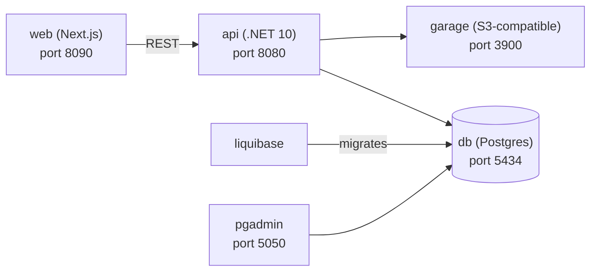

# nextjs

A small full-stack CRM-style sample app: a .NET API backed by Postgres (via Liquibase migrations) and Garage (S3-compatible object storage), with a Next.js web frontend. Everything runs via Docker Compose.

## Architecture



| Service    | Tech               | Purpose                                   | README |
|------------|--------------------|--------------------------------------------|--------|
| `web`      | Next.js 16, React 19 | Frontend UI                               | [web/README.md](web/README.md) |
| `api`      | .NET 10, Dapper     | REST API (contacts, countries, documents) | [api/README.md](api/README.md) |
| `db`       | Postgres 18         | Primary relational database               | [database/README.md](database/README.md) |
| `liquibase`| Liquibase 5         | Schema migrations & seed data             | [database/README.md](database/README.md) |
| `garage`   | Garage 2.3          | S3-compatible object storage for documents| [garage/README.md](garage/README.md) |
| `pgadmin`  | pgAdmin 4           | Optional Postgres admin UI                | — |

## Getting started

Requirements: Docker + Docker Compose.

```bash
make start   # build and start everything
make api     # start db + api only
make db      # start db + liquibase only
make stop    # stop all containers
```

Ports and credentials are configured in [.env](.env).

## Local (non-Docker) development

- **api**: `cd api/App.Api && dotnet run` (uses [appsettings.Development.json](api/App.Api/appsettings.Development.json), expects `db` on `localhost:5434` and `garage` on `localhost:3900` — start those via `make db` and `docker compose up -d garage` first).
- **web**: `cd web && npm install && npm run dev` (hot-reloading dev server on port 3000).

Note: services started with `docker compose up -d` do **not** hot-reload — rebuild the image after code changes with `docker compose up -d --build <service>`.

