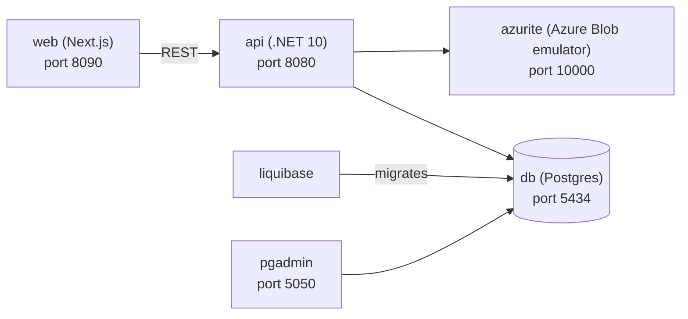

# nextjs

A small full-stack CRM-style sample app: a .NET API backed by Postgres (via Liquibase migrations) and blob storage for documents, with a Next.js web frontend. Local development uses Azurite, and the API now supports Azure Blob Storage by default with AWS S3 as an optional alternative.

## Architecture



- `web`: Next.js 16, React 19 frontend UI. See [web/README.md](web/README.md).
- `api`: .NET 10, Dapper REST API for contacts, countries, and documents. See [api/README.md](api/README.md).
- `db`: Postgres 18 primary database. See [database/README.md](database/README.md).
- `liquibase`: Liquibase 5 migrations and seed data. See [database/README.md](database/README.md).
- `azurite`: Local Azure Blob Storage emulator for documents.
- `localstack`: Local AWS-compatible S3 emulator for documents.
- `pgadmin`: Optional Postgres admin UI.

## Document storage

- The API selects the document storage provider from `ObjectStorage:Provider`.
- `Azure` is the default provider when no explicit value is set.
- Local Docker uses Azurite by default on port `10000`.
- Local Docker can also use LocalStack S3 on port `4566` by setting `OBJECT_STORAGE_PROVIDER=Aws` before startup.
- Local `dotnet run` can target either provider through the matching `ObjectStorage:*` settings.

## Getting started

Requirements: Docker + Docker Compose.

```bash
make start   # build and start everything
make api     # start db + api only
make db      # start db + liquibase only
make azurite # start local blob storage only
OBJECT_STORAGE_PROVIDER=Aws make start # switch local Docker to LocalStack S3
make stop    # stop all containers
```

Ports and credentials are configured in [.env](.env).

## Local (non-Docker) development

- **api**: `cd api/App.Api && dotnet run` (uses [appsettings.Development.json](api/App.Api/appsettings.Development.json), expects `db` on `localhost:5434` and Azurite on `localhost:10000` by default; switch `ObjectStorage:Provider` and `ObjectStorage:Aws:*` if you want local S3 instead).
- **web**: `cd web && npm install && npm run dev` (hot-reloading dev server on port 3000).

For local document uploads, the API creates the `documents` blob container automatically when it starts.

Note: services started with `docker compose up -d` do **not** hot-reload — rebuild the image after code changes with `docker compose up -d --build <service>`.

## Azure foundation and deploy

The GitHub Actions deployment flow uses Azure OIDC via `azure/login@v2`. The shared foundation workflow is [setup-foundation.yml](.github/workflows/setup-foundation.yml).

### 1. Create the Azure app registration for GitHub Actions

Create an Entra ID app registration or service principal that GitHub Actions can use. Record these values:

- `AZURE_CLIENT_ID`
- `AZURE_TENANT_ID`
- `AZURE_SUBSCRIPTION_ID`

You can retrieve the tenant and subscription IDs with:

```bash
az account show --query id -o tsv
az account show --query tenantId -o tsv
```

For the app registration client ID:

```bash
az ad app list --display-name "<app-registration-name>" --query "[0].appId" -o tsv
```

Grant the service principal enough access to deploy the subscription-level and resource-group-level infrastructure used by `infra/azure/subscription.bicep`. `Contributor` on the target subscription is the simplest option for initial setup.

### 2. Add the federated credential for this repo

In the Azure app registration, add a federated credential that matches this repository and the GitHub environment used by the workflow:

- issuer: `https://token.actions.githubusercontent.com`
- subject: `repo:<owner>/<repo>:environment:production`
- audience: `api://AzureADTokenExchange`

This must match the workflow environment in [setup-foundation.yml](.github/workflows/setup-foundation.yml).

### 3. Configure GitHub environment secrets and variables

In GitHub, open `Settings -> Environments -> production` and set these values.

Local development now uses Azurite via Docker Compose. The secrets below are only for the existing Azure foundation deployment path, which has not been migrated yet and still provisions Garage-backed object storage.

Secrets:

- `AZURE_CLIENT_ID`
- `AZURE_TENANT_ID`
- `AZURE_SUBSCRIPTION_ID`
- `DB_ADMIN_PASSWORD`
- `GARAGE_ACCESS_KEY`
- `GARAGE_SECRET_KEY`
- `GARAGE_RPC_SECRET`
- `GARAGE_ADMIN_TOKEN`

Variables:

- `AZURE_RESOURCE_GROUP`
- `AZURE_LOCATION` (optional, defaults to `uksouth`)

The workflow now validates these before attempting Azure login, so missing configuration fails with a direct error instead of the generic `SERVICE_PRINCIPAL` message.

### 4. Run the foundation workflow

In GitHub Actions, run `Setup Foundation`. It deploys the shared Azure foundation defined in `infra/azure/subscription.bicep`, including the resource group, container registry, container apps environment, database, key vault, and the current Garage-backed object storage layer.

If you prefer to deploy the same foundation locally with Azure CLI instead of GitHub Actions:

```bash
make infra-up \
    DB_ADMIN_PASSWORD='<db-password>' \
    GARAGE_ACCESS_KEY='<garage-access-key>' \
    GARAGE_SECRET_KEY='<garage-secret-key>' \
    GARAGE_RPC_SECRET='<openssl rand -hex 32>' \
    GARAGE_ADMIN_TOKEN='<openssl rand -base64 32>'
```

Before running that locally, authenticate with Azure CLI and select the correct subscription:

```bash
az login
az account set --subscription "<subscription-id-or-name>"
```

### 5. Build and deploy the app

After the foundation exists, deploy in this order:

1. Build and push the API image: `make infra-build-push`
2. Build and push the web image: `make infra-build-push-web API_BASE_URL=https://<your-api-host>`
3. Deploy both images into the existing foundation: `make infra-deploy-app`

The same pieces are also available via GitHub workflows:

- [build-api.yml](.github/workflows/build-api.yml)
- [deploy-app.yml](.github/workflows/deploy-app.yml)
- [deploy-branch.yml](.github/workflows/deploy-branch.yml)

### 6. Tear down

To delete the shared resource group locally:

```bash
make infra-down RESOURCE_GROUP=<your-resource-group>
```

Or run the `Teardown Foundation` GitHub Actions workflow.

